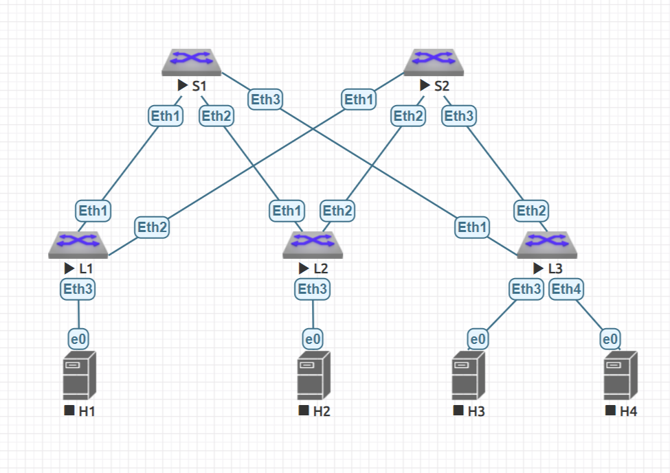

# DC address space

## Goals
* Build a CLOS network
* Assign P2P link addresses and setup loopbacks

## The netowrk



## Address plan

IP addresses is convenient to be assigned according to the next rule.

```
10.D * n.S.i
   |   | | |
   |   | | +------- Sequential number
   |   | +--------- Spine's number
   |   +----------- DC multiplier (1..N)
   +--------------- Distinguisher
```
, where D is

|  N  | Meaning    |
| --- | ---------- |
|  0  | Loopback 1 |
|  1  | Loopback 2 |
|  2  | P2P links  |
|  3  | Reserved   |
| 4-7 | Services   |

### Loopback interfaces

| Address  | Prefix | Interface |
| ---------| -----: | --------- |
| 10.0.0.1 | 32     | L1/Lo1    |
| 10.0.0.2 | 32     | L2/Lo1    |
| 10.0.0.3 | 32     | L3/Lo1    |
| 10.0.1.0 | 32     | S1/Lo1    |
| 10.0.2.0 | 32     | S2/Lo1    |
| 10.1.0.1 | 32     | L1/Lo2    |
| 10.1.0.2 | 32     | L2/Lo2    |
| 10.1.0.3 | 32     | L3/Lo2    |
| 10.1.1.0 | 32     | S1/Lo2    |
| 10.1.2.0 | 32     | S2/Lo2    |

### P2P links

| Address  | Prefix | Interface | $${\color {lightgray}FE}$$      |
| -------- | ------ | --------- | ------------------------------- |
| 10.2.1.0 | 31     | S1/Eth1   | $${\color {lightgray}L1/Eth1}$$ |
| 10.2.1.1 | 31     | L1/Eth1   | $${\color {lightgray}S1/Eth1}$$ |
| 10.2.1.2 | 31     | S1/Eth2   | $${\color {lightgray}L2/Eth1}$$ |
| 10.2.1.3 | 31     | L2/Eth1   | $${\color {lightgray}S1/Eth2}$$ |
| 10.2.1.4 | 31     | S1/Eth3   | $${\color {lightgray}L3/Eth1}$$ |
| 10.2.1.5 | 31     | L3/Eth1   | $${\color {lightgray}S1/Eth3}$$ |
| 10.2.2.0 | 31     | S2/Eth1   | $${\color {lightgray}L1/Eth2}$$ |
| 10.2.2.1 | 31     | L1/Eth2   | $${\color {lightgray}S2/Eth1}$$ |
| 10.2.2.2 | 31     | S2/Eth2   | $${\color {liGhtgray}L2/Eth2}$$ |
| 10.2.2.3 | 31     | L2/Eth2   | $${\color {lightgray}S2/Eth2}$$ |
| 10.2.2.4 | 31     | S2/Eth3   | $${\color {lightgray}L3/Eth2}$$ |
| 10.2.2.5 | 31     | L3/Eth2   | $${\color {lightgray}S2/Eth3}$$ |


## Devices setups
### Spines

Spines settings may be summarized as a [spine.m4](spine.m4) script and then created in the next way:

```bash
m4 spine.m4              \
    -D HOSTNAME=spine-1  \
    -D ETH1=10.2.1.0/31  \
    -D ETH2=10.2.1.2/31  \
    -D ETH3=10.2.1.4/31  \
    -D  LO1=10.0.1.0/32  \
    -D  LO2=10.1.1.0/32  \
> spine-1.cfg

m4 spine.m4              \
    -D HOSTNAME=spine-2  \
    -D ETH1=10.2.2.0/31  \
    -D ETH2=10.2.2.2/31  \
    -D ETH3=10.2.2.4/31  \
    -D  LO1=10.0.2.0/32  \
    -D  LO2=10.1.2.0/32  \
> spine-2.cfg
```
### Leafs

Leaf's settings may be summarized as a [leaf.m4](leaf.m4) script and then created in the next way:

```bash
m4 leaf.m4                 \
    -D  HOSTNAME=leaf-1    \
    -D  LO1=10.0.0.1/32    \
    -D  LO2=10.1.0.1/32    \
    -D ETH1=10.2.1.1/31    \
    -D ETH2=10.2.2.1/31    \
> leaf-1.cfg

m4 leaf.m4                 \
    -D  HOSTNAME=leaf-2    \
    -D  LO1=10.0.0.2/32    \
    -D  LO2=10.1.0.2/32    \
    -D ETH1=10.2.1.3/31    \
    -D ETH2=10.2.2.3/31    \
> leaf-2.cfg

m4 leaf.m4                 \
    -D  HOSTNAME=leaf-3    \
    -D  LO1=10.0.0.3/32    \
    -D  LO2=10.1.0.3/32    \
    -D ETH1=10.2.1.5/31    \
    -D ETH2=10.2.2.5/31    \
> leaf-3.cfg
```

## Check connectivity

After all of the *.cfg files are apllied on all devices respectively, all leafs P2P interfaces should be accessible from spines.

<details>
    <summary>Spine-1</summary>

```
spine-1>ping 10.2.1.1
PING 10.2.1.1 (10.2.1.1) 72(100) bytes of data.
80 bytes from 10.2.1.1: icmp_seq=1 ttl=64 time=116 ms
80 bytes from 10.2.1.1: icmp_seq=2 ttl=64 time=24.0 ms
80 bytes from 10.2.1.1: icmp_seq=3 ttl=64 time=8.00 ms
80 bytes from 10.2.1.1: icmp_seq=4 ttl=64 time=8.00 ms
80 bytes from 10.2.1.1: icmp_seq=5 ttl=64 time=8.00 ms

--- 10.2.1.1 ping statistics ---
5 packets transmitted, 5 received, 0% packet loss, time 408ms
rtt min/avg/max/mdev = 8.000/32.802/116.007/42.061 ms, ipg/ewma 102.006/72.652 ms
spine-1>
spine-1>ping 10.2.1.3
PING 10.2.1.3 (10.2.1.3) 72(100) bytes of data.
80 bytes from 10.2.1.3: icmp_seq=1 ttl=64 time=84.0 ms
80 bytes from 10.2.1.3: icmp_seq=2 ttl=64 time=16.0 ms
80 bytes from 10.2.1.3: icmp_seq=3 ttl=64 time=8.00 ms
80 bytes from 10.2.1.3: icmp_seq=4 ttl=64 time=8.00 ms
80 bytes from 10.2.1.3: icmp_seq=5 ttl=64 time=8.00 ms

--- 10.2.1.3 ping statistics ---
5 packets transmitted, 5 received, 0% packet loss, time 300ms
rtt min/avg/max/mdev = 8.000/24.801/84.005/29.763 ms, ipg/ewma 75.004/53.223 ms
spine-1>
spine-1>ping 10.2.1.5
PING 10.2.1.5 (10.2.1.5) 72(100) bytes of data.
80 bytes from 10.2.1.5: icmp_seq=1 ttl=64 time=88.0 ms
80 bytes from 10.2.1.5: icmp_seq=2 ttl=64 time=16.0 ms
80 bytes from 10.2.1.5: icmp_seq=3 ttl=64 time=8.00 ms
80 bytes from 10.2.1.5: icmp_seq=4 ttl=64 time=8.00 ms
80 bytes from 10.2.1.5: icmp_seq=5 ttl=64 time=12.0 ms

--- 10.2.1.5 ping statistics ---
5 packets transmitted, 5 received, 0% packet loss, time 308ms
rtt min/avg/max/mdev = 8.000/26.401/88.006/30.945 ms, ipg/ewma 77.004/56.068 ms
spine-1>
```

</details>

<details>
    <summary>Spine-2</summary>

```
spine-2>ping 10.2.2.1
PING 10.2.2.1 (10.2.2.1) 72(100) bytes of data.
80 bytes from 10.2.2.1: icmp_seq=1 ttl=64 time=76.0 ms
80 bytes from 10.2.2.1: icmp_seq=2 ttl=64 time=8.00 ms
80 bytes from 10.2.2.1: icmp_seq=3 ttl=64 time=12.0 ms
80 bytes from 10.2.2.1: icmp_seq=4 ttl=64 time=12.0 ms
80 bytes from 10.2.2.1: icmp_seq=5 ttl=64 time=12.0 ms

--- 10.2.2.1 ping statistics ---
5 packets transmitted, 5 received, 0% packet loss, time 272ms
rtt min/avg/max/mdev = 8.001/24.001/76.005/26.048 ms, ipg/ewma 68.004/49.184 ms
spine-2>
spine-2>ping 10.2.2.3
PING 10.2.2.3 (10.2.2.3) 72(100) bytes of data.
80 bytes from 10.2.2.3: icmp_seq=1 ttl=64 time=20.0 ms
80 bytes from 10.2.2.3: icmp_seq=2 ttl=64 time=8.00 ms
80 bytes from 10.2.2.3: icmp_seq=3 ttl=64 time=16.0 ms
80 bytes from 10.2.2.3: icmp_seq=4 ttl=64 time=12.0 ms
80 bytes from 10.2.2.3: icmp_seq=5 ttl=64 time=8.00 ms

--- 10.2.2.3 ping statistics ---
5 packets transmitted, 5 received, 0% packet loss, time 84ms
rtt min/avg/max/mdev = 8.000/12.800/20.001/4.667 ms, ipg/ewma 21.001/16.238 ms
spine-2>
spine-2>ping 10.2.2.5
PING 10.2.2.5 (10.2.2.5) 72(100) bytes of data.
80 bytes from 10.2.2.5: icmp_seq=1 ttl=64 time=24.0 ms
80 bytes from 10.2.2.5: icmp_seq=2 ttl=64 time=8.00 ms
80 bytes from 10.2.2.5: icmp_seq=3 ttl=64 time=8.00 ms
80 bytes from 10.2.2.5: icmp_seq=4 ttl=64 time=8.00 ms
80 bytes from 10.2.2.5: icmp_seq=5 ttl=64 time=12.0 ms

--- 10.2.2.5 ping statistics ---
5 packets transmitted, 5 received, 0% packet loss, time 92ms
rtt min/avg/max/mdev = 8.000/12.000/24.001/6.198 ms, ipg/ewma 23.001/17.880 ms
spine-2>
```

</details>

