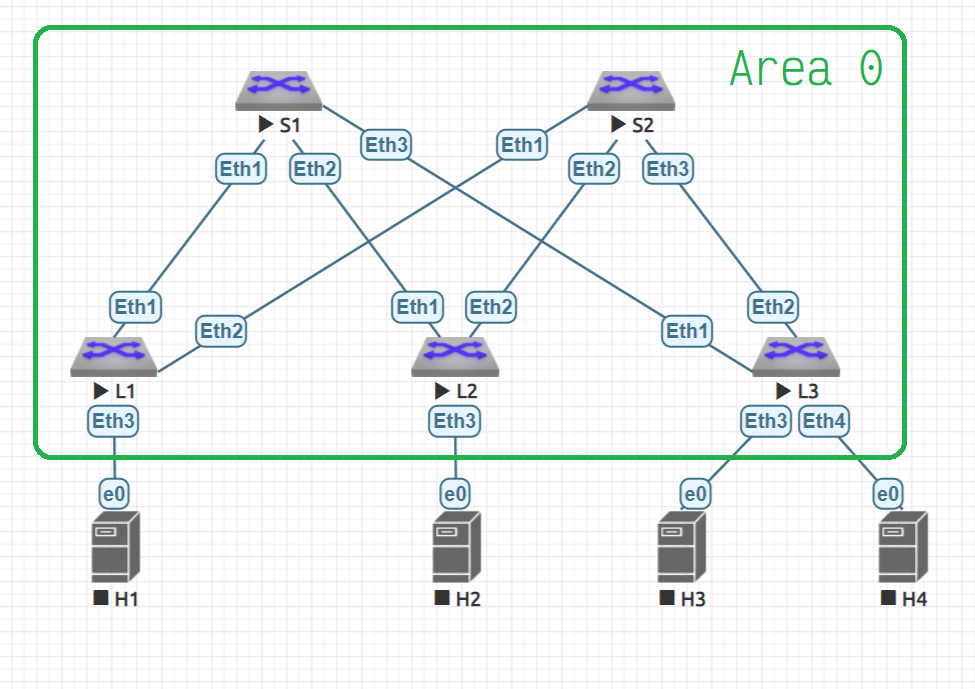

# OSPF as an underlay routing protocol

## Goals
* Build a CLOS network
* Setup OSPF for all the devices
* Check the IP connectivity

## The network



## Devices setups
### Spines
Spines settings may be summarized as a [spine.m4](spine.m4) script and then created in the next way:

```bash
m4 spine.m4                  \
    -D HOSTNAME=spine-1      \
    -D ETH1=10.2.1.0/31      \
    -D ETH2=10.2.1.2/31      \
    -D ETH3=10.2.1.4/31      \
    -D  LO1=10.0.1.0/32      \
    -D  LO2=10.1.1.0/32      \
> spine-1.cfg

m4 spine.m4                  \
    -D HOSTNAME=spine-2      \
    -D ETH1=10.2.2.0/31      \
    -D ETH2=10.2.2.2/31      \
    -D ETH3=10.2.2.4/31      \
    -D  LO1=10.0.2.0/32      \
    -D  LO2=10.1.2.0/32      \
> spine-2.cfg
```

### Leafs

Leaf's settings may be summarized as a [leaf.m4](leaf.m4) script and then created in the next way:

```bash
m4 leaf.m4                 \
    -D  HOSTNAME=leaf-1    \
    -D  LO1=10.0.0.1/32    \
    -D  LO2=10.1.0.1/32    \
    -D ETH1=10.2.1.1/31    \
    -D ETH2=10.2.2.1/31    \
> leaf-1.cfg

m4 leaf.m4                 \
    -D  HOSTNAME=leaf-2    \
    -D  LO1=10.0.0.2/32    \
    -D  LO2=10.1.0.2/32    \
    -D ETH1=10.2.1.3/31    \
    -D ETH2=10.2.2.3/31    \
> leaf-2.cfg

m4 leaf.m4                 \
    -D  HOSTNAME=leaf-3    \
    -D  LO1=10.0.0.3/32    \
    -D  LO2=10.1.0.3/32    \
    -D ETH1=10.2.1.5/31    \
    -D ETH2=10.2.2.5/31    \
> leaf-3.cfg
```

## Check connectivity

After all of the *.cfg files are apllied on all devices respectively, we should see all the Spines OSPF neghbours

### Spine-1

```
spine-1>show ip ospf neighbor
Neighbor ID     VRF      Pri State                  Dead Time   Address         Interface
10.0.0.1        default  0   FULL                   00:00:36    10.2.1.1        Ethernet1
10.0.0.2        default  0   FULL                   00:00:31    10.2.1.3        Ethernet2
10.0.0.3        default  0   FULL                   00:00:39    10.2.1.5        Ethernet3

spine-1>show ip route ospf

VRF: default
Codes: C - connected, S - static, K - kernel,
       O - OSPF, IA - OSPF inter area, E1 - OSPF external type 1,
       E2 - OSPF external type 2, N1 - OSPF NSSA external type 1,
       N2 - OSPF NSSA external type2, B I - iBGP, B E - eBGP,
       R - RIP, I L1 - IS-IS level 1, I L2 - IS-IS level 2,
       O3 - OSPFv3, A B - BGP Aggregate, A O - OSPF Summary,
       NG - Nexthop Group Static Route, V - VXLAN Control Service,
       DH - Dhcp client installed default route

 O      10.0.0.1/32 [110/20] via 10.2.1.1, Ethernet1
 O      10.0.0.2/32 [110/20] via 10.2.1.3, Ethernet2
 O      10.0.0.3/32 [110/20] via 10.2.1.5, Ethernet3
 O      10.0.2.0/32 [110/30] via 10.2.1.1, Ethernet1
                             via 10.2.1.3, Ethernet2
                             via 10.2.1.5, Ethernet3
 O      10.1.0.1/32 [110/20] via 10.2.1.1, Ethernet1
 O      10.1.0.2/32 [110/20] via 10.2.1.3, Ethernet2
 O      10.1.0.3/32 [110/20] via 10.2.1.5, Ethernet3
 O      10.1.2.0/32 [110/30] via 10.2.1.1, Ethernet1
                             via 10.2.1.3, Ethernet2
                             via 10.2.1.5, Ethernet3
 O      10.2.2.0/31 [110/20] via 10.2.1.1, Ethernet1
 O      10.2.2.2/31 [110/20] via 10.2.1.3, Ethernet2
 O      10.2.2.4/31 [110/20] via 10.2.1.5, Ethernet3
```

### Spine-2

```
spine-2>show ip ospf neighbor
Neighbor ID     VRF      Pri State                  Dead Time   Address         Interface
10.0.0.1        default  0   FULL                   00:00:34    10.2.2.1        Ethernet1
10.0.0.2        default  0   FULL                   00:00:30    10.2.2.3        Ethernet2
10.0.0.3        default  0   FULL                   00:00:38    10.2.2.5        Ethernet3

spine-2>show ip route ospf

VRF: default
Codes: C - connected, S - static, K - kernel,
       O - OSPF, IA - OSPF inter area, E1 - OSPF external type 1,
       E2 - OSPF external type 2, N1 - OSPF NSSA external type 1,
       N2 - OSPF NSSA external type2, B I - iBGP, B E - eBGP,
       R - RIP, I L1 - IS-IS level 1, I L2 - IS-IS level 2,
       O3 - OSPFv3, A B - BGP Aggregate, A O - OSPF Summary,
       NG - Nexthop Group Static Route, V - VXLAN Control Service,
       DH - Dhcp client installed default route

 O      10.0.0.1/32 [110/20] via 10.2.2.1, Ethernet1
 O      10.0.0.2/32 [110/20] via 10.2.2.3, Ethernet2
 O      10.0.0.3/32 [110/20] via 10.2.2.5, Ethernet3
 O      10.0.1.0/32 [110/30] via 10.2.2.1, Ethernet1
                             via 10.2.2.3, Ethernet2
                             via 10.2.2.5, Ethernet3
 O      10.1.0.1/32 [110/20] via 10.2.2.1, Ethernet1
 O      10.1.0.2/32 [110/20] via 10.2.2.3, Ethernet2
 O      10.1.0.3/32 [110/20] via 10.2.2.5, Ethernet3
 O      10.1.1.0/32 [110/30] via 10.2.2.1, Ethernet1
                             via 10.2.2.3, Ethernet2
                             via 10.2.2.5, Ethernet3
 O      10.2.1.0/31 [110/20] via 10.2.2.1, Ethernet1
 O      10.2.1.2/31 [110/20] via 10.2.2.3, Ethernet2
 O      10.2.1.4/31 [110/20] via 10.2.2.5, Ethernet3
```


