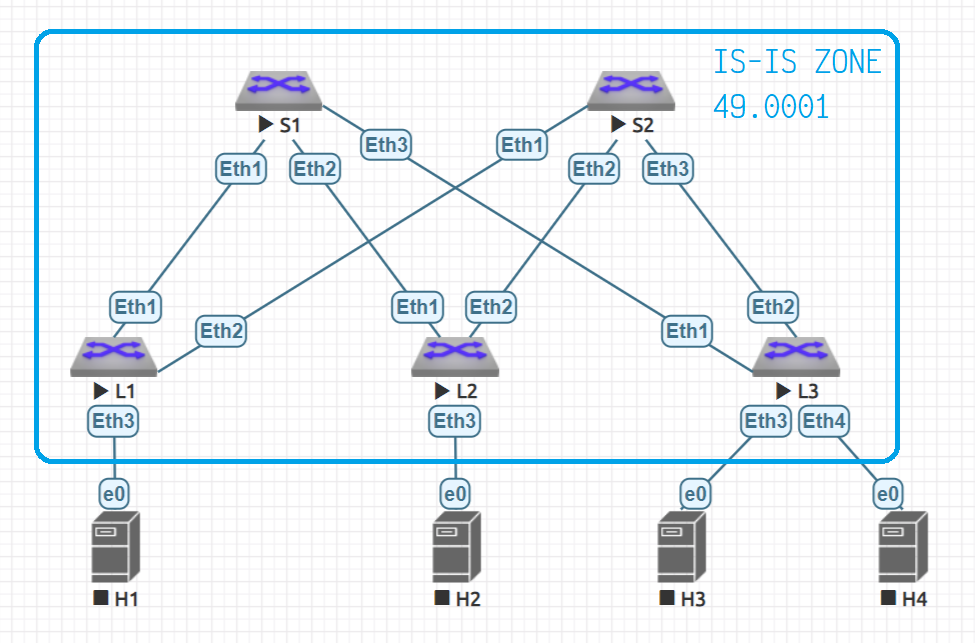

# IS-IS as an underlay routing protocol

## The goals
* Build a CLOS network
* Setup IS-IS as an underlay routing protocol
* Check IP connectivity

## Network



## Network entity titles

We'll keep all the devices within the same IS-IS area 49.0001.
Hence all the devices are of level-1 devices (in terms of IS-IS protocol) and their NETs are the next:

| Host    | NET                       |
| ------- | ------------------------- |
| spine-1 | 49.0001.0100.0100.1000.00 |
| spine-2 | 49.0001.0100.0100.2000.00 |
| leaf-1  | 49.0001.0100.0100.0001.00 |
| leaf-2  | 49.0001.0100.0100.0002.00 |
| leaf-3  | 49.0001.0100.0100.0003.00 |

Where:

```
49.ZZZZ.0100.0100.DDDD.00
   ^^^^           ^^^^
       \              \______ Device identifier 
        \____________________ IS-IS zone
```

You can see that nothing differs but device identifiers. 
Leafs have IDs like 0001, 0002, 0003 and so on, while the spines ID's are 1000, 2000, etc.

## Devices settings
### Spines

Spines settings may be summarized as a [spine.m4](spine.m4) script and then created in the next way:

```bash
m4 spine.m4                  \
    -D HOSTNAME=spine-1      \
    -D ETH1=10.2.1.0/31      \
    -D ETH2=10.2.1.2/31      \
    -D ETH3=10.2.1.4/31      \
    -D  LO1=10.0.1.0/32      \
    -D  LO2=10.1.1.0/32      \
    -D ZONE=0001             \
    -D DEVICE=1000           \
> spine-1.cfg

m4 spine.m4                  \
    -D HOSTNAME=spine-2      \
    -D ETH1=10.2.2.0/31      \
    -D ETH2=10.2.2.2/31      \
    -D ETH3=10.2.2.4/31      \
    -D  LO1=10.0.2.0/32      \
    -D  LO2=10.1.2.0/32      \
    -D ZONE=0001             \
    -D DEVICE=2000           \
> spine-2.cfg
```

### Leafs

Leaf's settings may be summarized as a [leaf.m4](leaf.m4) script and then created in the next way:

```bash
m4 leaf.m4                 \
    -D  HOSTNAME=leaf-1    \
    -D  LO1=10.0.0.1/32    \
    -D  LO2=10.1.0.1/32    \
    -D ETH1=10.2.1.1/31    \
    -D ETH2=10.2.2.1/31    \
    -D ZONE=0001           \
    -D DEVICE=0001         \
> leaf-1.cfg

m4 leaf.m4                 \
    -D  HOSTNAME=leaf-2    \
    -D  LO1=10.0.0.2/32    \
    -D  LO2=10.1.0.2/32    \
    -D ETH1=10.2.1.3/31    \
    -D ETH2=10.2.2.3/31    \
    -D ZONE=0001           \
    -D DEVICE=0002         \
> leaf-2.cfg

m4 leaf.m4                 \
    -D  HOSTNAME=leaf-3    \
    -D  LO1=10.0.0.3/32    \
    -D  LO2=10.1.0.3/32    \
    -D ETH1=10.2.1.5/31    \
    -D ETH2=10.2.2.5/31    \
    -D ZONE=0001           \
    -D DEVICE=0003         \
> leaf-3.cfg
```

## Check IP connectivity
### Check spines neighbourhood statuses
#### Spine-1

```
spine-1>show isis neighbors

Instance  VRF      System Id        Type Interface          SNPA              State Hold time   Circuit Id
underlay  default  leaf-1           L1   Ethernet1          P2P               UP    23          0C
underlay  default  leaf-2           L1   Ethernet2          P2P               UP    26          0D
underlay  default  leaf-3           L1   Ethernet3          P2P               UP    21          0E
spine-1>
spine-1>show ip route

VRF: default
Codes: C - connected, S - static, K - kernel,
       O - OSPF, IA - OSPF inter area, E1 - OSPF external type 1,
       E2 - OSPF external type 2, N1 - OSPF NSSA external type 1,
       N2 - OSPF NSSA external type2, B I - iBGP, B E - eBGP,
       R - RIP, I L1 - IS-IS level 1, I L2 - IS-IS level 2,
       O3 - OSPFv3, A B - BGP Aggregate, A O - OSPF Summary,
       NG - Nexthop Group Static Route, V - VXLAN Control Service,
       DH - Dhcp client installed default route

Gateway of last resort is not set

 I L1   10.0.0.1/32 [115/20] via 10.2.1.1, Ethernet1
 I L1   10.0.0.2/32 [115/20] via 10.2.1.3, Ethernet2
 I L1   10.0.0.3/32 [115/20] via 10.2.1.5, Ethernet3
 C      10.0.1.0/32 is directly connected, Loopback1
 I L1   10.0.2.0/32 [115/30] via 10.2.1.1, Ethernet1
                             via 10.2.1.3, Ethernet2
                             via 10.2.1.5, Ethernet3
 I L1   10.1.0.1/32 [115/20] via 10.2.1.1, Ethernet1
 I L1   10.1.0.2/32 [115/20] via 10.2.1.3, Ethernet2
 I L1   10.1.0.3/32 [115/20] via 10.2.1.5, Ethernet3
 C      10.1.1.0/32 is directly connected, Loopback2
 I L1   10.1.2.0/32 [115/30] via 10.2.1.1, Ethernet1
                             via 10.2.1.3, Ethernet2
                             via 10.2.1.5, Ethernet3
 C      10.2.1.0/31 is directly connected, Ethernet1
 C      10.2.1.2/31 is directly connected, Ethernet2
 C      10.2.1.4/31 is directly connected, Ethernet3
 I L1   10.2.2.0/31 [115/20] via 10.2.1.1, Ethernet1
 I L1   10.2.2.2/31 [115/20] via 10.2.1.3, Ethernet2
 I L1   10.2.2.4/31 [115/20] via 10.2.1.5, Ethernet3
spine-1>
```

#### Spine 2
```
spine-2>show isis neighbors

Instance  VRF      System Id        Type Interface          SNPA              State Hold time   Circuit Id
underlay  default  leaf-1           L1   Ethernet1          P2P               UP    26          0C
underlay  default  leaf-2           L1   Ethernet2          P2P               UP    24          0D
underlay  default  leaf-3           L1   Ethernet3          P2P               UP    23          0E
spine-2>
spine-2>show ip route

VRF: default
Codes: C - connected, S - static, K - kernel,
       O - OSPF, IA - OSPF inter area, E1 - OSPF external type 1,
       E2 - OSPF external type 2, N1 - OSPF NSSA external type 1,
       N2 - OSPF NSSA external type2, B I - iBGP, B E - eBGP,
       R - RIP, I L1 - IS-IS level 1, I L2 - IS-IS level 2,
       O3 - OSPFv3, A B - BGP Aggregate, A O - OSPF Summary,
       NG - Nexthop Group Static Route, V - VXLAN Control Service,
       DH - Dhcp client installed default route

Gateway of last resort is not set

 I L1   10.0.0.1/32 [115/20] via 10.2.2.1, Ethernet1
 I L1   10.0.0.2/32 [115/20] via 10.2.2.3, Ethernet2
 I L1   10.0.0.3/32 [115/20] via 10.2.2.5, Ethernet3
 I L1   10.0.1.0/32 [115/30] via 10.2.2.1, Ethernet1
                             via 10.2.2.3, Ethernet2
                             via 10.2.2.5, Ethernet3
 C      10.0.2.0/32 is directly connected, Loopback1
 I L1   10.1.0.1/32 [115/20] via 10.2.2.1, Ethernet1
 I L1   10.1.0.2/32 [115/20] via 10.2.2.3, Ethernet2
 I L1   10.1.0.3/32 [115/20] via 10.2.2.5, Ethernet3
 I L1   10.1.1.0/32 [115/30] via 10.2.2.1, Ethernet1
                             via 10.2.2.3, Ethernet2
                             via 10.2.2.5, Ethernet3
 C      10.1.2.0/32 is directly connected, Loopback2
 I L1   10.2.1.0/31 [115/20] via 10.2.2.1, Ethernet1
 I L1   10.2.1.2/31 [115/20] via 10.2.2.3, Ethernet2
 I L1   10.2.1.4/31 [115/20] via 10.2.2.5, Ethernet3
 C      10.2.2.0/31 is directly connected, Ethernet1
 C      10.2.2.2/31 is directly connected, Ethernet2
 C      10.2.2.4/31 is directly connected, Ethernet3

spine-2>
```

### Check leafs loopbacks are reachable accorss DC
We shoud ping leaf-2 and leaf-3 loopbacks from leaf-1

```
leaf-1#ping 10.0.0.2
PING 10.0.0.2 (10.0.0.2) 72(100) bytes of data.
80 bytes from 10.0.0.2: icmp_seq=1 ttl=63 time=52.0 ms
80 bytes from 10.0.0.2: icmp_seq=2 ttl=63 time=40.0 ms
80 bytes from 10.0.0.2: icmp_seq=3 ttl=63 time=52.0 ms
80 bytes from 10.0.0.2: icmp_seq=4 ttl=63 time=28.0 ms
80 bytes from 10.0.0.2: icmp_seq=5 ttl=63 time=40.0 ms

--- 10.0.0.2 ping statistics ---
5 packets transmitted, 5 received, 0% packet loss, time 208ms
rtt min/avg/max/mdev = 28.002/42.402/52.004/8.984 ms, pipe 2, ipg/ewma 52.003/46.873 ms
leaf-1#
leaf-1#ping 10.1.0.2
PING 10.1.0.2 (10.1.0.2) 72(100) bytes of data.
80 bytes from 10.1.0.2: icmp_seq=1 ttl=63 time=60.0 ms
80 bytes from 10.1.0.2: icmp_seq=2 ttl=63 time=32.0 ms
80 bytes from 10.1.0.2: icmp_seq=3 ttl=63 time=60.0 ms
80 bytes from 10.1.0.2: icmp_seq=4 ttl=63 time=40.0 ms
80 bytes from 10.1.0.2: icmp_seq=5 ttl=63 time=44.0 ms

--- 10.1.0.2 ping statistics ---
5 packets transmitted, 5 received, 0% packet loss, time 236ms
rtt min/avg/max/mdev = 32.002/47.203/60.004/11.143 ms, pipe 2, ipg/ewma 59.003/53.471 ms
leaf-1#
leaf-1#ping 10.1.0.3
PING 10.1.0.3 (10.1.0.3) 72(100) bytes of data.
80 bytes from 10.1.0.3: icmp_seq=1 ttl=63 time=48.0 ms
80 bytes from 10.1.0.3: icmp_seq=2 ttl=63 time=52.0 ms
80 bytes from 10.1.0.3: icmp_seq=3 ttl=63 time=40.0 ms
80 bytes from 10.1.0.3: icmp_seq=4 ttl=63 time=32.0 ms
80 bytes from 10.1.0.3: icmp_seq=5 ttl=63 time=40.0 ms

--- 10.1.0.3 ping statistics ---
5 packets transmitted, 5 received, 0% packet loss, time 200ms
rtt min/avg/max/mdev = 32.002/42.402/52.003/6.978 ms, pipe 2, ipg/ewma 50.003/44.822 ms
leaf-1#
leaf-1#ping 10.0.0.3
PING 10.0.0.3 (10.0.0.3) 72(100) bytes of data.
80 bytes from 10.0.0.3: icmp_seq=1 ttl=63 time=28.0 ms
80 bytes from 10.0.0.3: icmp_seq=2 ttl=63 time=28.0 ms
80 bytes from 10.0.0.3: icmp_seq=3 ttl=63 time=68.0 ms
80 bytes from 10.0.0.3: icmp_seq=4 ttl=63 time=36.0 ms

--- 10.0.0.3 ping statistics ---
5 packets transmitted, 4 received, 20% packet loss, time 120ms
rtt min/avg/max/mdev = 28.002/40.002/68.004/16.494 ms, pipe 3, ipg/ewma 30.002/33.377 ms
leaf-1#

```
Now lets try leaf-1 loppbacks from, for instance, leaf-3
```
leaf-3#ping 10.0.0.1
PING 10.0.0.1 (10.0.0.1) 72(100) bytes of data.
80 bytes from 10.0.0.1: icmp_seq=1 ttl=63 time=36.0 ms
80 bytes from 10.0.0.1: icmp_seq=2 ttl=63 time=44.0 ms
80 bytes from 10.0.0.1: icmp_seq=3 ttl=63 time=32.0 ms
80 bytes from 10.0.0.1: icmp_seq=4 ttl=63 time=20.0 ms
80 bytes from 10.0.0.1: icmp_seq=5 ttl=63 time=76.0 ms

--- 10.0.0.1 ping statistics ---
5 packets transmitted, 5 received, 0% packet loss, time 152ms
rtt min/avg/max/mdev = 20.001/41.602/76.005/18.866 ms, pipe 2, ipg/ewma 38.002/39.540 ms
leaf-3#
leaf-3#ping 10.1.0.1
PING 10.1.0.1 (10.1.0.1) 72(100) bytes of data.
80 bytes from 10.1.0.1: icmp_seq=1 ttl=63 time=36.0 ms
80 bytes from 10.1.0.1: icmp_seq=2 ttl=63 time=36.0 ms
80 bytes from 10.1.0.1: icmp_seq=3 ttl=63 time=40.0 ms
80 bytes from 10.1.0.1: icmp_seq=4 ttl=63 time=56.0 ms
80 bytes from 10.1.0.1: icmp_seq=5 ttl=63 time=44.0 ms

--- 10.1.0.1 ping statistics ---
5 packets transmitted, 5 received, 0% packet loss, time 152ms
rtt min/avg/max/mdev = 36.002/42.402/56.004/7.422 ms, pipe 2, ipg/ewma 38.002/39.572 ms
leaf-3#
leaf-3#
```
Seems like everything is ok with it.

