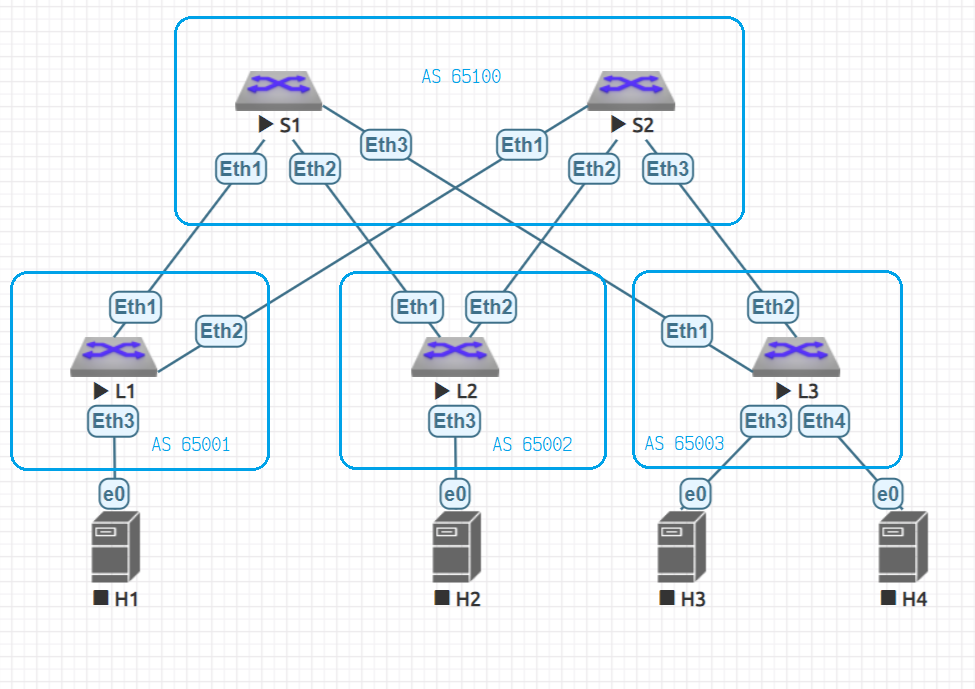

# eBGP as an underlay routing protocol

## The goals
* Build a CLOS network
* Setup eBGP as an underlay routing protocol
* Check IP connectivity

## Network



## Autonomous systems 

| Host    | AS    |
| ------- | ----- |
| spine-1 | 65100 |
| spine-2 | 65100 |
| leaf-1  | 65001 |
| leaf-2  | 65002 |
| leaf-3  | 65003 |


## Devices settings
### Leafs

Leaf's settings may be summarized as a [leaf.m4](leaf.m4) script and then created in the next way:

```bash
m4 leaf.m4                           \
    -D  HOSTNAME=leaf-1              \
    -D          LO1=10.0.0.1/32      \
    -D          LO2=10.1.0.1/32      \
    -D         ETH1=10.2.1.1/31      \
    -D         ETH2=10.2.2.1/31      \
    -D ETH1_BFD_NBR=10.2.1.0         \
    -D ETH2_BFD_NBR=10.2.2.0         \
    -D     LOCAL_AS=65001            \
    -D    REMOTE_AS=65100            \
    -D         NBR1=10.2.1.0         \
    -D         NBR2=10.2.2.0         \
> leaf-1.cfg
m4 leaf.m4                           \
    -D  HOSTNAME=leaf-2              \
    -D          LO1=10.0.0.2/32      \
    -D          LO2=10.1.0.2/32      \
    -D         ETH1=10.2.1.3/31      \
    -D         ETH2=10.2.2.3/31      \
    -D ETH1_BFD_NBR=10.2.1.2         \
    -D ETH2_BFD_NBR=10.2.2.2         \
    -D     LOCAL_AS=65002            \
    -D    REMOTE_AS=65100            \
    -D         NBR1=10.2.1.2         \
    -D         NBR2=10.2.2.2         \
> leaf-2.cfg
m4 leaf.m4                           \
    -D  HOSTNAME=leaf-3              \
    -D          LO1=10.0.0.3/32      \
    -D          LO2=10.1.0.3/32      \
    -D         ETH1=10.2.1.5/31      \
    -D         ETH2=10.2.2.5/31      \
    -D ETH1_BFD_NBR=10.2.1.4         \
    -D ETH2_BFD_NBR=10.2.2.4         \
    -D     LOCAL_AS=65003            \
    -D    REMOTE_AS=65100            \
    -D         NBR1=10.2.1.4         \
    -D         NBR2=10.2.2.4         \
> leaf-3.cfg

```

### Spines

Spines settings may be summarized as a [spine.m4](spine.m4) script and then created as it's shown below.
Note that we summarize all the interfaces as a single subnet to listen.
Also AS range is used to define all leafs as one.

```bash
m4 spine.m4                          \
    -D     HOSTNAME=spine-1          \
    -D         ETH1=10.2.1.0/31      \
    -D         ETH2=10.2.1.2/31      \
    -D         ETH3=10.2.1.4/31      \
    -D          LO1=10.0.1.0/32      \
    -D          LO2=10.1.1.0/32      \
    -D ETH1_BFD_NBR=10.2.1.1         \ 
    -D ETH2_BFD_NBR=10.2.1.3         \
    -D ETH3_BFD_NBR=10.2.1.5         \
    -D           AS=65100            \
    -D        RANGE=65001-65003      \ 
    -D       SUBNET=10.2.1.0/24      \ 
> spine-1.cfg

m4 spine.m4                          \
    -D     HOSTNAME=spine-2          \
    -D         ETH1=10.2.2.0/31      \
    -D         ETH2=10.2.2.2/31      \
    -D         ETH3=10.2.2.4/31      \
    -D          LO1=10.0.2.0/32      \
    -D          LO2=10.1.2.0/32      \
    -D ETH1_BFD_NBR=10.2.2.1         \ 
    -D ETH2_BFD_NBR=10.2.2.3         \
    -D ETH3_BFD_NBR=10.2.2.5         \
    -D           AS=65100            \
    -D        RANGE=65001-65003      \
    -D       SUBNET=10.2.2.0/24      \
> spine-2.cfg

```
## Check settings

Lets inspect leaf-1 settings to check everything is OK
First check BGP neigbours:
```
leaf-1#show ip bgp summary
BGP summary information for VRF default
Router identifier 10.0.0.1, local AS number 65001
Neighbor Status Codes: m - Under maintenance
  Neighbor         V  AS           MsgRcvd   MsgSent  InQ OutQ  Up/Down State  PfxRcd PfxAcc
  10.2.1.0         4  65100            128       127    0    0 00:06:06 Estab  3      3
  10.2.2.0         4  65100            123       129    0    0 00:06:04 Estab  3      3
leaf-1#
```

The routes we've got via BGP

```
leaf-1#show ip route bgp

VRF: default
Codes: C - connected, S - static, K - kernel,
       O - OSPF, IA - OSPF inter area, E1 - OSPF external type 1,
       E2 - OSPF external type 2, N1 - OSPF NSSA external type 1,
       N2 - OSPF NSSA external type2, B I - iBGP, B E - eBGP,
       R - RIP, I L1 - IS-IS level 1, I L2 - IS-IS level 2,
       O3 - OSPFv3, A B - BGP Aggregate, A O - OSPF Summary,
       NG - Nexthop Group Static Route, V - VXLAN Control Service,
       DH - Dhcp client installed default route

 B E    10.0.0.2/32 [200/0] via 10.2.1.0, Ethernet1
                            via 10.2.2.0, Ethernet2
 B E    10.0.0.3/32 [200/0] via 10.2.1.0, Ethernet1
                            via 10.2.2.0, Ethernet2
 B E    10.0.1.0/32 [200/0] via 10.2.1.0, Ethernet1
 B E    10.0.2.0/32 [200/0] via 10.2.2.0, Ethernet2

leaf-1#
```

The another leaf (leaf-3) Loopback 1 is reachable from the own Looback 1

```
leaf-1#ping 10.0.0.3 source 10.0.0.1
PING 10.0.0.3 (10.0.0.3) from 10.0.0.1 : 72(100) bytes of data.
80 bytes from 10.0.0.3: icmp_seq=1 ttl=63 time=52.0 ms
80 bytes from 10.0.0.3: icmp_seq=2 ttl=63 time=40.0 ms
80 bytes from 10.0.0.3: icmp_seq=3 ttl=63 time=28.0 ms
80 bytes from 10.0.0.3: icmp_seq=4 ttl=63 time=32.0 ms
80 bytes from 10.0.0.3: icmp_seq=5 ttl=63 time=44.0 ms

--- 10.0.0.3 ping statistics ---
5 packets transmitted, 5 received, 0% packet loss, time 208ms
rtt min/avg/max/mdev = 28.002/39.202/52.003/8.543 ms, ipg/ewma 52.003/45.513 ms
leaf-1#
```

BFD is OK as well
```
leaf-1#show bfd neighbors
VRF name: default
-----------------
DstAddr      MyDisc   YourDisc     Interface    Type          LastUp  LastDown
-------- ---------- ---------- -------------- ------- --------------- ---------
10.2.1.0  848388805 4018142413 Ethernet1(19)  normal  08/07/24 15:06        NA
10.2.2.0 3381257326 2799380587 Ethernet2(20)  normal  08/07/24 15:06        NA

        LastDiag    State
------------------- -----
   No Diagnostic       Up
   No Diagnostic       Up

leaf-1#
```

